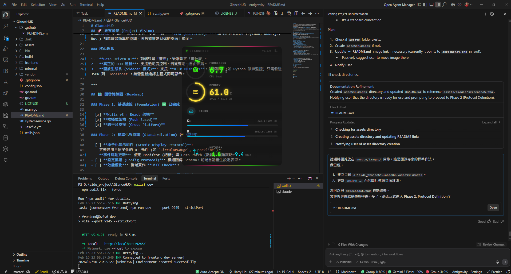

# GlanceHUD


-red?style=flat-square>)


**GlanceHUD** 是一個現代化、模組化的 **跨平台 (Cross-Platform)** 桌面懸浮監控儀表板。
專為需要隨時掌握系統狀態（CPU、記憶體、硬碟、網路），但追求極簡、無干擾體驗的使用者設計。

> **注意**: 目前主要開發與測試環境為 **Windows**，其他平台 (macOS, Linux) 理論上支援但尚未完整驗證。



---

## 🚀 專案願景 (Project Vision)

我們的最終目標是打造一個 **「通用監控平台 (Universal Monitoring Platform)」**。
GlanceHUD 不僅是一個監控工具，更是一個 **「容器 (Container)」**，讓任何程式語言 (Python, Node.js, Rust) 都能透過簡單的協議，將數據推送到你的桌面上顯示。

### 核心理念

1.  **Data-Driven UI**: 前端只是「畫布」，後端決定「畫什麼」。
2.  **真正的 HUD 體驗**: 支援透明度控制、滑鼠穿透、自由佈局。
3.  **開放生態系 (Sidecar 模式)**: 支援 **HTTP Push API**。外部腳本 (如 Python 訓練監控) 只需發送 JSON 到 `localhost`，無需重新編譯主程式即可顯示。

---

## 🗺️ 開發路線圖 (Roadmap)

### Phase 1: 基礎建設 (Foundation) ✅ 已完成

- [x] **Wails v3 + React 架構**
- [x] **推播式架構 (Push-Based)**
- [x] **跨平台支援 (Cross-Platform)**

### Phase 2: 標準化與協議 (Standardization) ✅ 已完成

- [x] **原子化顯示組件 (Atomic Display Protocol)**:
  - 定義通用且原子化的 UI 元件 (`gauge`, `bar-list`, `key-value`, `text`)。
  - **事件驅動更新**: 使用 RenderConfig (結構) 與 DataPayload (數據) 分離策略。
- [x] **設定協議 (Config Protocol)**: 模組回傳 Schema，前端自動產生設定表單 (`text`, `number`, `bool`, `select`, `checkboxes`)。
- [x] **效能優化**: 後端實作 **Diff Check** (`reflect.DeepEqual`)。
- [x] **Modern Minimal UI**: Glass-morphism 設計、狀態色系、Framer Motion 動畫、內容自適應視窗大小。

### Phase 3: 進階 HUD 體驗 (Advanced HUD) 📅 規劃中

- [ ] **System Tray 整合**
- [ ] **視窗控制**: 鎖定模式 (穿透) vs 編輯模式 (拖放佈局)。

### Phase 4: 生態系與擴充 (Ecosystem) 📅 規劃中

- [ ] **雙向 HTTP API (Bi-directional API)**:
  - **資料注入 (Push)**: 開放 `POST /api/widget`，允許外部程式 (Python, Bash, CI/CD) 推送自定義數據到 HUD 顯示 (例如：ML Training Loss)。
  - **狀態查詢 (Pull)**: 開放 `GET /api/stats`，允許外部裝置 (如 Home Assistant, Stream Deck) 讀取當前系統監控數據。
- [ ] **插件系統 (Sidecar Plugins)**:
  - 透過設定檔定義並自動啟動外部腳本 (Sidecar)，透過標準輸入/輸出 (stdio) 或 HTTP 與主程式溝通。

---

## ✨ 目前功能 (Current Features)

- **Zero-Config Start (即裝即用)**: 模組自動偵測系統分割區並產生預設設定，無需手動配置。
- **Glass-morphism UI**: 無邊框、背景透明、磨砂玻璃質感、狀態色系 (green → amber → red)。
- **全域極簡模式 (Minimal Mode)**: 設定中一鍵切換，所有模組改為精簡 key-value 顯示。
- **內容自適應視窗**: 視窗高度自動配合內容，無固定大小限制。
- **獨立更新頻率**: CPU 每秒、Memory 每 2 秒、Disk 每 10 秒、Network 每秒。
- **熱更新設定 (Hot Reload)**: 開關模組、切換極簡模式、變更磁碟選擇，存檔即生效，無需重啟。
- **支援模組**:
  - **CPU**: 即時負載 (Gauge + RingProgress 動畫)。
  - **Memory**: RAM 使用率 (Gauge + AnimatedNumber)。
  - **Disk**: 多磁區偵測，Checkbox 多選顯示 (Bar-list + Spring 動畫)。
  - **Network**: 即時上下行網速 (Key-value + Icon)。

---

## 🛠️ 開發與安裝 (Development)

### 前置需求

- Go 1.25+
- Node.js 18+
- [Wails v3 CLI (Alpha)](https://v3.wails.io/installation)
  > **注意**: 本專案依賴 Wails v3 Alpha 版本，API 變動較大，請確保安裝最新版本。

### 啟動開發環境

```bash
# 在專案根目錄
wails3 dev
```

### 建置發布

```bash
go build
# 產出 GlanceHUD.exe
```

## 📜 License

MIT
